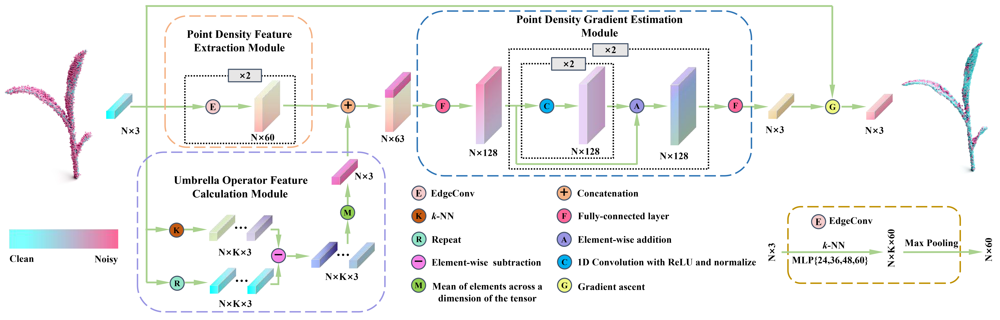

# PDN-plant-denoising-net
# Description
This is the code implementation of the PDN method described in the paper “Plant-Denoising-Net (PDN): A Plant Point Cloud Denoising Network based on Density Gradient Field Learning”.

# Introduction
PDN is a network proposed for denoising plant point clouds based on point density gradient prediction and gradient ascent, which mainly includes three modules: point density feature (PDF) extraction module, umbrella operator feature (UOF) calculation module, and point density gradient (DG) estimation module. PDF extraction module extracts local features of points and maps them to higher-order point density features. This feature effectively addresses the challenges of uneven density and incompleteness of plant point cloud. UOF calculation module calculates the local umbrella operators of points as the umbrella operator features. This feature serves as a boundary condition for predicting the point density gradient to avoid severe deviations and mitigates the issue of hole expansion caused by incompleteness of plant point cloud during gradient ascent. DG estimation module applies to the fused features of the UOF and PDF. Finally, gradient ascent is performed on the predicted DG to achieve denoising.

see more details in our paper: “Plant-Denoising-Net (PDN): A Plant Point Cloud Denoising Network based on Density Gradient Field Learning”
# Getting Started
Dataset download link: https://drive.google.com/drive/folders/1-4LNb0jcSCpKWJ7Ngr5XlRwo7IpyYF8G?usp=sharing
# License
This project is licensed under the MIT License - see the LICENSE.md file for details.
# Citation
# Acknowledgments
